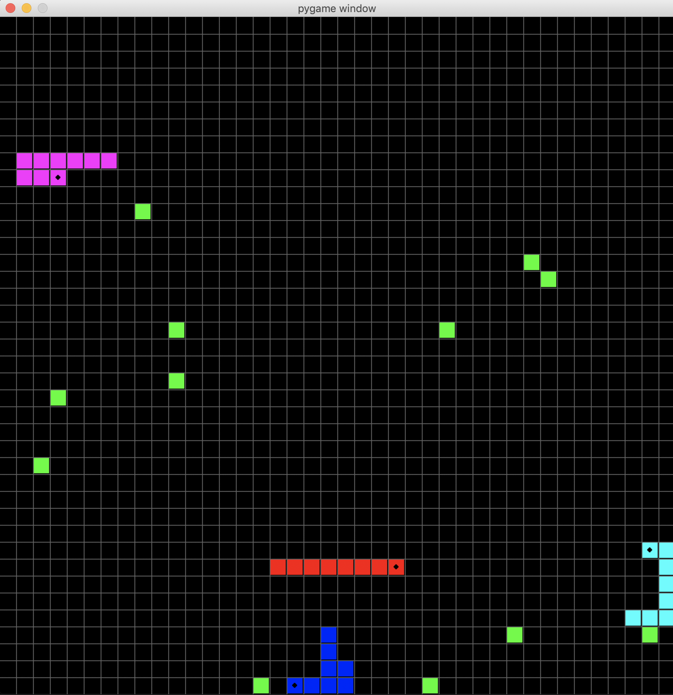
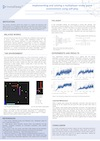

# SLITHERIN'

### Motivation
The primary motivation behind this project is to assess the behaviour that agents acquire in a multiplayer snake game environment when trained using a reinforcement learning algorithm with self-play. Also, this project tries to tackle the challenge termed Slitherin’  in the openai's "request for research 2.0".


### The Environment
The environment, built with pygame as a Gym environment, consists of a 40x40 2D grid with fruits and snakes. Snakes increase in length when they eat(collide against) fruits and a new fruit appears at a random grid position whenever any fruit is eaten. Snakes die when they collide with the walls, themselves or other snakes. When a snake dies, it turns into fruits. The game ends when all snakes die.<br/>
An agent's observation is designed in such a way that it always seems to be moving northward. This gives it a choice of just 3 actions; turn left, turn right, and keep straight. An observation, for an agent,  is a tuple consisting of the obstacles in front of and beside its head position, closest opponent’s position relative to the head and closest food position relative to the head. <br/>
An agent gets a reward of +30 when it eats a fruit and -100 if it dies. The environment is solved with an overall score of 500 for 2 agents and 1000 for 4 agents.


### Prerequisites
  - Tensorflow (2.0)
  - pygame

### Installation
1. Clone the repository
  ```Shell
  https://github.com/ldfrancis/OpenAI-Requests-for-Research-2.0.git
  ```
2. Go to the SLITHERIN' directory
  ```Shell
  cd "SLITHERIN'"
  ```
3. Install gym_slitherin
  ```Shell
  pip install -e .
  ```
  
### Usage
1. Train agents: while in the SLITHERIN' directory,
  ```Shell
  python train.py --env 4 --render --model train_agents
  ```
  This instantiates and environment with 4 snakes and renders the environment while training networks to be saved in the folder 'train_agents' to solve the environment
  
2. Test trained policies: while in the SLITHERIN' directory,
  ```Shell
  python policy_test.py --env 4 --model train_agents
  ```
  This instantiates and environment with 4 snakes and renders the environment while taking agents' action from a policy network saved in the folder 'train_agents'.
  
### Poster
[](poster/poster.pdf)
